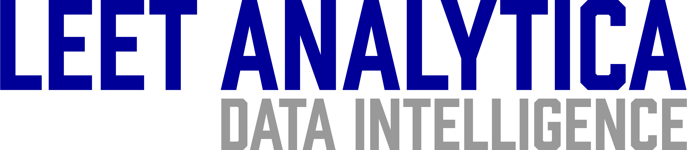

Leet Analytica is a continuously improved AI that is developed to assist businesses, law enforcement agencies and security companies collect, process and use quality data and tools.

# FALCONSWEEP FEATURES

This section details the features of FalconSweep we have made available for Leet Analytica clients.

## Socila Media Collectors:

- [x] Twitter Collector: Collects Data from logical sets of keywords.

### ROADMAP

- [ ] Facebook Collector
- [ ] Instagram Collector
- [ ] TikTok Collector

## Conventional Search Engines:

- [x] Google Collector
- [x] Bing Collector
- [x] Duckduckgo Collector

### ROADMAP

- [ ] Leaked Databases
- [ ] Dark Web Search
- [ ] API Collection

## Static Collections:

- [x] Email Collector
- [x] Telephone Number Collector

### ROADMAP

- [ ] Usernames Collector

# PROCESSORS

For accurate generation of data, we have made available the following tools:

- [x] Cleaning Datasets by Removing Duplications
- [x] Email Verifier
- [x] Phone Number Verifier

### ROADMAP

- [ ] Merging Datasets
